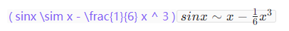
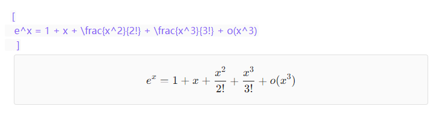

# LaTeX Formula Support for Obsidian

> Render LaTeX formulas in edit mode with KaTeX. Supports `\(...\)` and `\[...\]` syntax with live preview.

You can use it quite simply—just install it!

This plugin enhances your editing experience by rendering LaTeX mathematical expressions directly within the editor, providing a WYSIWYG (What You See Is What You Get) feel. It uses [KaTeX](https://katex.org/) for fast and beautiful math rendering.

## 🖼️ Feature Preview

### Inline Formulas (`\( ... \)`)

### Block Formulas (`\[ ... \]`)

## 📦 Installation

### Via Obsidian Community Plugins (Recommended)

1. Open Obsidian.
2. Go to `Settings` > `Community plugins`.
3. Click `Browse` and search for "LaTeX Formula Support".
4. Click `Install` and then `Enable`.

### Manual Installation

1. Download the latest release files (`main.js`, `styles.css`, `manifest.json`) from the [Releases](https://github.com/YumeAyai/obsidian-picbeduploader/releases) page.
2. Create a folder named `latex-formula-support` inside your Obsidian vault's `.obsidian/plugins/` directory.
3. Copy the downloaded files into this folder.
4. Restart Obsidian and enable the plugin in `Settings` > `Community plugins`.

## 💰 Donations

I would be grateful for any donation to support the development of this plugin.

## Author
- **Author:** YumeAyai
- **GitHub Profile:** [YumeAyai](https://github.com/YumeAyai)
- **Donations:** 

Feel free to contribute to the development of this plugin or report any issues in the [GitHub repository](https://github.com/YumeAyai/LaTeX-Formula-Support/issues).